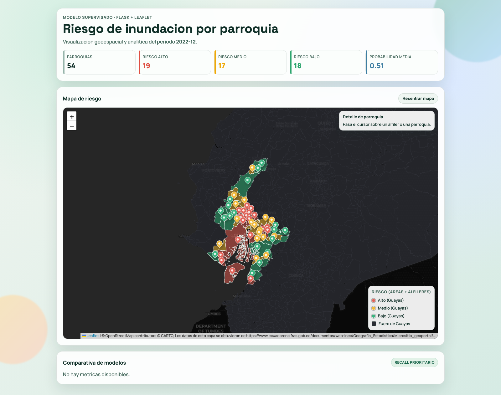

# Riesgo de Inundacion por Parroquia (Guayas)

Proyecto de clasificacion supervisada para estimar riesgo de inundacion por parroquia en Guayas, usando datos reales oficiales del Ecuador y despliegue web con Flask.

## Enlaces del proyecto

- Repositorio GitHub: <https://github.com/jpmachinelearning/riesgo_inundacion_ec>
- Aplicacion en produccion (PythonAnywhere): <https://projectj2026.pythonanywhere.com>

## Vista de la aplicacion web

URL publica: <https://projectj2026.pythonanywhere.com>



## Alcance

- Problema: clasificacion supervisada de riesgo por parroquia.
- Cobertura: 54 parroquias oficiales de Guayas.
- Restriccion cumplida: sin datos sinteticos ni etiquetas de riesgo predefinidas.

## Fuentes oficiales

- INEC DPA parroquial (ArcGIS):  
  <https://services7.arcgis.com/iFGeGXTAJXnjq0YN/ArcGIS/rest/services/Parroquias_del_Ecuador/FeatureServer/0>
- INEC Censo 2022 MANLOC CSV:  
  <https://www.ecuadorencifras.gob.ec/documentos/web-inec/bd-censo/manzana/BDD_CPV2022_MANLOC_CSV.zip>
- IGM DTM WMS (topografia):  
  <https://www.geoportaligm.gob.ec/dtm/ows>
- Base historica consolidada para clima/eventos:  
  `data/raw/dataset_proyecto.csv`

## Variables del modelo

- Climaticas: `precipitacion_mensual_prom_mm`, `precipitacion_mensual_p95_mm`, `precipitacion_anual_prom_mm`, `temperatura_media_prom_c`, `humedad_relativa_prom`, `cerca_rio_prom`.
- Topograficas: `altitud_igm_m`, `pendiente_igm` (derivada), `rango_altitud_igm_m` (derivada).
- Socio-territoriales: `poblacion_2022`, `hogares_2022`, `viviendas_2022`, `densidad_poblacional_2022`, `pct_urbana_2022`, `indice_compacidad`, entre otras.

## Variable objetivo

Se construye por parroquia con historial observado:

- `tasa_inundacion_historica = eventos_inundacion / total_periodos`
- `target_alto_riesgo = 1` si la tasa está en o sobre el percentil 66 (umbral del entrenamiento: `0.125`).

## Modelos implementados

- Regresion Logistica (base)
- Arbol de Decision
- Ensamble (RL + DT + RF)
- Arbol de Decision optimizado con `GridSearchCV`

Metricas reportadas: `precision`, `recall` (prioritaria), `f1`, `roc_auc`.

## Ejecucion local

### 1) Instalar dependencias

```bash
python3 -m venv .venv
source .venv/bin/activate
pip install -r requirements.txt
```

### 2) Entrenar y generar artefactos

```bash
python3 ml/train_and_prepare.py
```

Artefactos principales:

- `outputs/dataset_guayas_oficial_completo.csv`
- `outputs/predicciones_parroquias.csv`
- `outputs/resumen_metricas_modelos.csv`
- `outputs/modelo_entrenado.joblib`
- `outputs/fuentes_y_metodologia_oficial.json`
- `app/data/parroquias_riesgo.geojson`
- `app/data/predicciones_parroquias.csv`

### 3) Ejecutar app Flask

```bash
flask --app app.app run --host=0.0.0.0 --port=5000
```

En produccion (sin debug):

```bash
gunicorn app.app:app --bind 0.0.0.0:${PORT:-8000}
```

## Notebook tecnico

- `notebooks/Proyecto_Riesgo_Inundacion.ipynb`
- Incluye: limpieza, EDA, construccion de etiqueta, entrenamiento, optimizacion, evaluacion y conclusiones.

## Validacion rapida

```bash
python3 scripts/preflight_check.py
```
